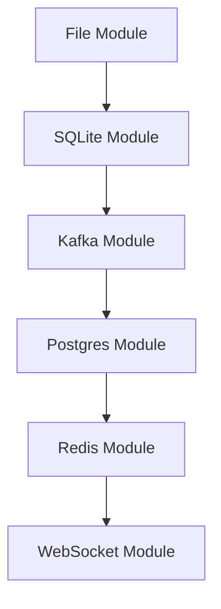

# ptp

pipe to pipe, just piping data to pipe data because why not

### Requirements

- go 1.20
- make
- air (optional)
- docker and docker-compose

### Usage

- mv .env.example .env
- go mod download
- docker compose up -d
- make dev

